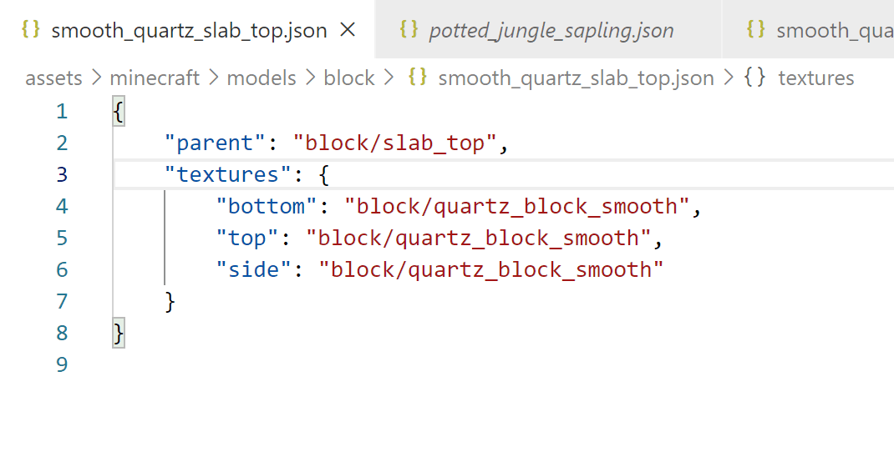

# minecraft assets helper

This extension features that can be used to improve productivity for CBer.

## Features

- Completions
- Goto Definitions
- Validator

## Install

You can install it from the [VSCode Marketplace](https://marketplace.visualstudio.com/items?itemName=)

## Completions

The extension can compute completions as you typing commands. Completions will automatically show if you commit one of these characters: ['/', '"'].

Alternatively you can use `Ctrl + Space` (or other configured hotkey) to show completions manually.

## Goto Definitions

You can goto the definitions of textures and models in the workspace by `Ctrl-clicking` on their names.

## Validator

It can help you verify the validity of the JSON file and display error messages and suggestions.

**Enjoy!**